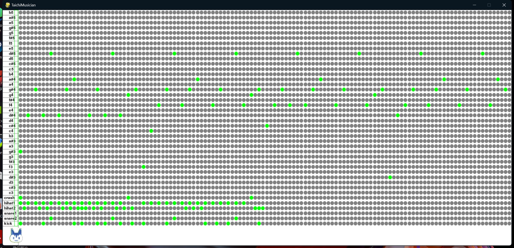

# TaichiMusician
 团队名：范特西
 ## Introduction
 项目名：TaichiMusician
 
 项目介绍：灵感来源于世界上著名的音乐制作软件FL studio， Cubase及Logic Pro等，想借助于Taichi编程语言的的简洁性，高效性，编写一款操作简单的小型音乐制作软件，能够让使用者省去繁杂的乐理学习，用最简单的软件操作，快速制作一首流行歌曲伴奏。
 
 项目制作流程：
 1. 乐器采样：把某类乐器的声音在几个八度的范围内把不同音符的音色拆分成独立的wav文件.
 2. 界面设计：设计为琴键加网格的布局，琴键不同八度区域对应不同音色乐器的不同音调即对应第一步的采样文件，使用到pygame.mixer.Sound函数。网格部分共4大节，每节16拍。
 3. 播放逻辑：整体不断循环播放，依照BPM控制时间条的前进速度，使其按照拍子正确运行到所制作音乐的正确播放位置，在对应位置播放使用pygame.play()函数同时播放音符，从而组合出整体的音乐效果。
 
 ## Installation
 pip install taichi
 
 pip install pygame
 
  ## Usage
  鼠标单击不同音符对应区域的灰色原点，变绿视为选中，选中后当播放标记移动到该处，则绿色处对应的音符会发出声音。
  press i:  返回初始播放位置，再次press i从初始位置重新播放。
  press p： 在当前位置暂停，再次press p，从当前位置继续播放。
  
   ***以周杰伦-《爱在西元前》为例，谱如下：***
  
  
